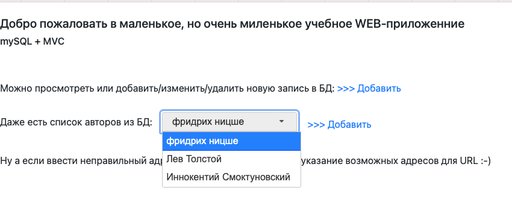
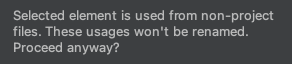
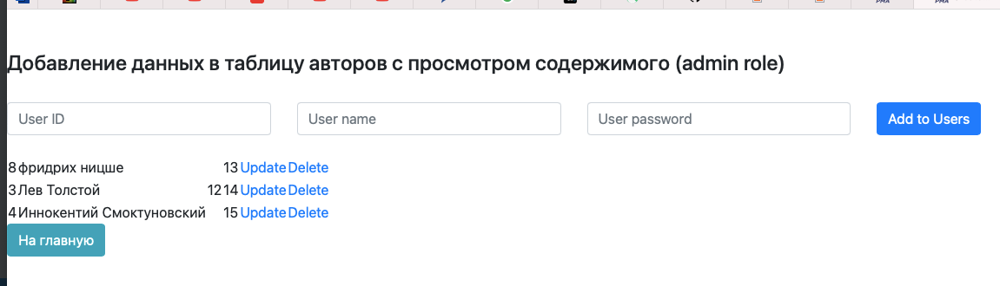

1. Добавил в корневую вьюшку выпадающий список авторов:

2. Добавил кнопки возврата на главную страницу в каждую вьюшку

3. Протрансферил данные об авторах в БД, подняв модель User и сделав Create/Updtae/Delete и вьюшку по аналогии

со скрытностью паролей и связью между таблицами БД поработать не успел;
