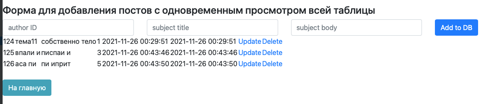

1. Добавил в корневую вьюшку выпадающий список авторов:
<pre>
</pre>

<pre>

</pre>
2. Добавил кнопки возврата на главную страницу в каждую вьюшку
<pre>
</pre>

<pre>

</pre>
3. Протрансферил данные об авторах в БД, подняв модель User и сделав Create/Updtae/Delete и вьюшку по аналогии
<pre>
</pre>

<pre>
</pre>
4. со скрытностью паролей и связью между таблицами БД поработать не успел;
5. осталось много лишнего, если будет необходимость - почищу...

